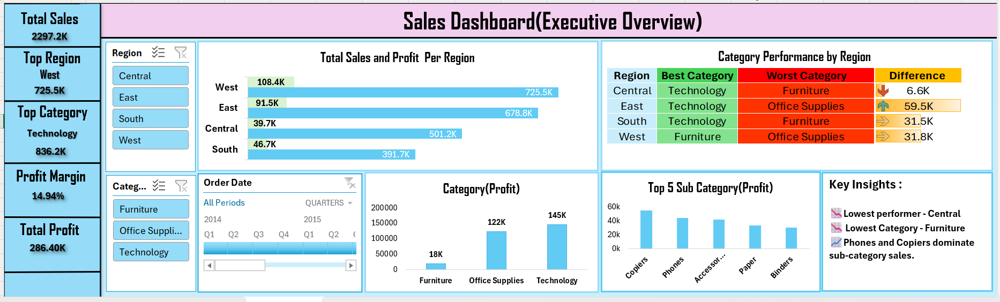
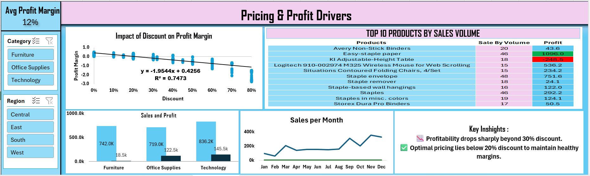
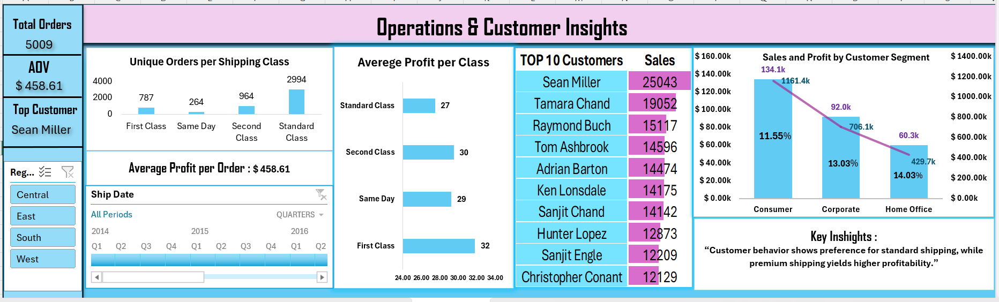

# 📊 Sales Analysis Dashboard (Excel)
## 🚀 Key Outcome
- Identified profit decline trend with increasing discounts (R² = 0.74)
- Detected loss-making products despite high sales volume
- Highlighted Technology as the most profitable category
  
---

## 📊 Dashboard Preview

### Executive Overview

### Pricing & Profit Drivers

### Operations & Customer Insights

---

## 🔍 Project Overview
This project analyzes sales performance, profitability, customer behavior, and operational efficiency using Excel dashboards.

---
  
## 📌 Business Questions

1. Which regions contribute the most to total sales?
2. Which product categories generate the highest profit?
3. How do discount rates impact profit margins?
4. Which shipping modes are most frequently used?
5. Who are the top customers by sales?
6. Which products are top 10 by volume and are they profitable?
7. Which region has lowest profitability?
8. Which customer segment contributes most?
9. Are there any loss-making products?

---

## 📈 Dashboards Created

### 1. Executive Overview
- Sales by Region
- Category Performance
- Top Sub-categories

### 2. Pricing & Profit Drivers
- Discount vs Profit analysis
- Top products performance
- Loss-making detection

### 3. Operations & Customer Insights
- Shipping mode analysis
- Customer segmentation
- Top customers

---

## 🛠 Tools Used
- Microsoft Excel
- Pivot Tables
- Charts & Slicers
- Conditional Formatting
- Functions

---

## 💡 Key Insights

- Higher discounts reduce profit margins significantly
- Technology is the most profitable category
- Few products generate losses despite high sales
- Sales are concentrated among top customers
---

## 📌 Business Impact

- Identified that discounts above 30% significantly reduce profitability
- Highlighted loss-making products despite high sales volume
- Provided actionable insights to optimize pricing strategy

---

## 📌 Business Recommendations

- Limit discount levels below 30% to maintain healthy profit margins
- Focus on Technology category for profit growth
- Monitor loss-making products and optimize pricing strategy
- Improve performance in underperforming regions like Central
- Strengthen relationships with top customers to retain revenue concentration

---

## 📄 Detailed Project Report

For complete analysis and business recommendations:

👉👉 [View Full Project Report](report/Sales_Project_Report.docx)

---

## 📂 Files
- Sales Dataset (CSV)
- Excel Dashboard
- Dashboard Screenshots

---

## 📚 What I Learned

- Translating business questions into analytical problems
- Building interactive dashboards using Pivot Tables and slicers
- Identifying patterns and deriving actionable insights
- Communicating findings clearly through visuals and reports

---

